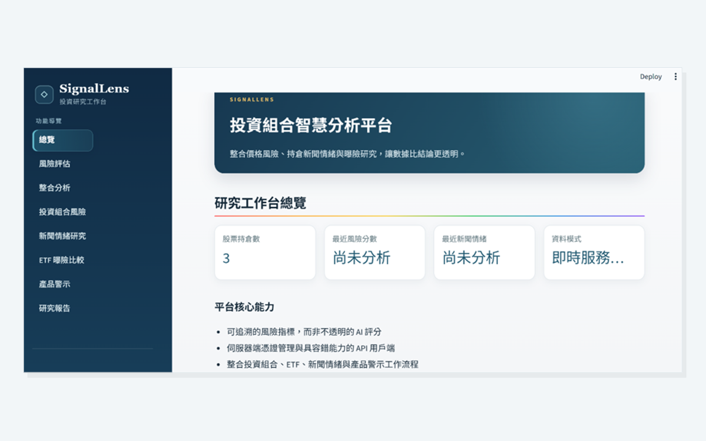
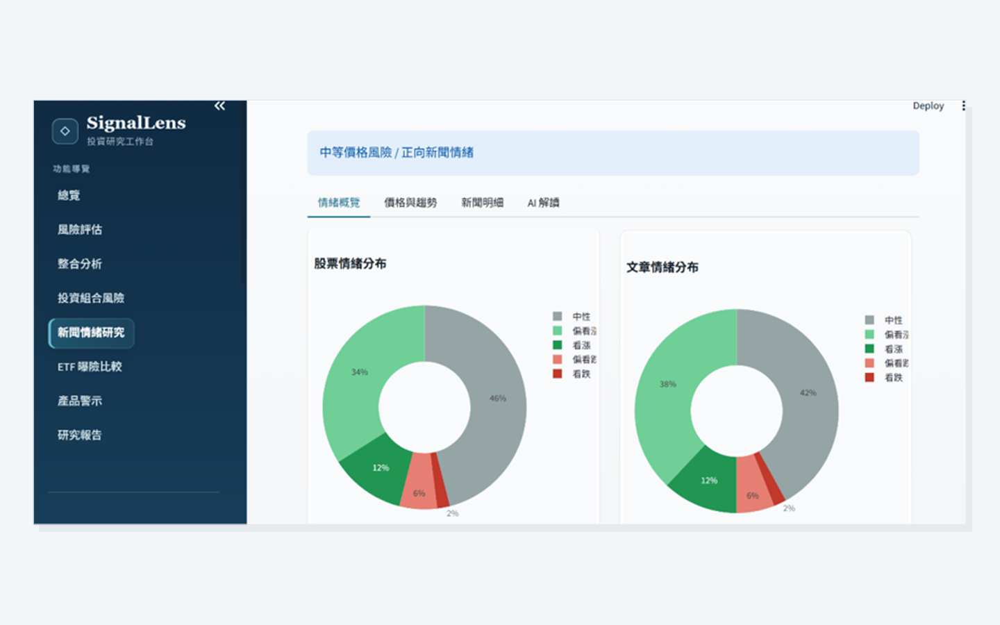
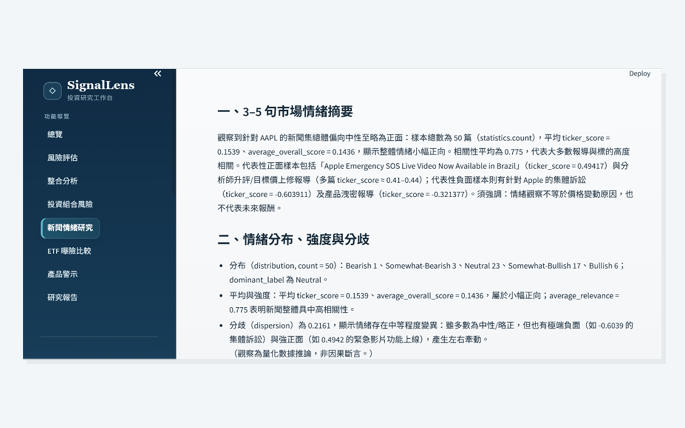
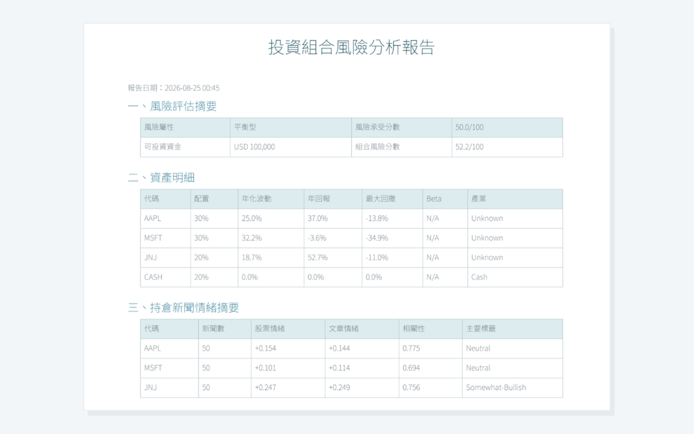
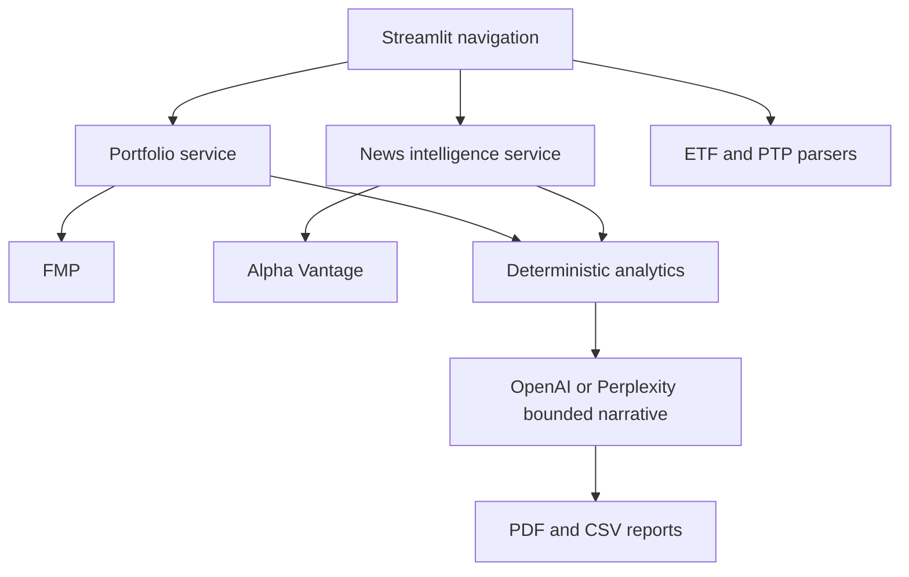

# SignalLens Portfolio Intelligence


[](https://signallens-ai-portfolio.streamlit.app/)

SignalLens is a Streamlit research application that combines explainable
portfolio-risk diagnostics, news sentiment, ETF exposure comparison and
user-supplied product alerts. It is an engineering portfolio project, not an
automated trading or investment-advice system.

## Product preview

[](https://signallens-ai-portfolio.streamlit.app/)

The workspace brings portfolio risk, investor profiling, news intelligence,
ETF exposure and report export into one Traditional Chinese interface.

| News sentiment dashboard | AI-assisted research summary |
| --- | --- |
|  |  |



The public [Live Demo](https://signallens-ai-portfolio.streamlit.app/) defaults
to offline data so visitors can explore the workflow without exposing API
credentials or consuming external-service quotas. The screenshots above show
the corresponding live-provider analysis and exported PDF workflow.

## Why this project exists

This project began as separate educational prototypes for portfolio risk and
news sentiment. The application was redesigned and reimplemented as a modular,
testable platform with server-side secrets, resilient provider clients,
deterministic calculations, responsible AI boundaries and an offline demo.

## Features

- **Investor Risk Assessment** — a transparent 20-question, four-dimension
  questionnaire whose deterministic result can be applied to later analyses.
- **Portfolio Risk** — volatility, drawdown, Beta-aware educational score,
  historical VaR/CVaR, HHI, effective positions and risk contribution.
- **News Intelligence** — Alpha Vantage sentiment, relevance, source and topic
  distributions, daily tone timeline and Alpha Vantage price context.
- **Integrated Analysis** — one workflow runs price risk and news research
  across every non-cash holding, then creates one bounded narrative and PDF.
- **Offline Demo** — synthetic, clearly labeled risk and news data work without credentials.
- **ETF Exposure** — holdings matching by ISIN, CUSIP and ticker aliases.
- **Product Alerts** — screens tickers against an uploaded current PTP list.
- **Responsible AI** — Python computes metrics; AI explains supplied results.
- **Model routing** — automatic task-based selection or manual choice among
  OpenAI `gpt-5-mini`, Perplexity `sonar`, `sonar-reasoning-pro`, and no-AI mode.
- **Reports** — PDF and CSV output with Traditional Chinese font support.

## Architecture



See [Architecture](docs/ARCHITECTURE.md), the
[Traditional Chinese feature guide](docs/FEATURE_GUIDE.zh-TW.md), and the
[Unified system specification](docs/UNIFIED_SYSTEM_SPEC.md) for product usage,
requirements, conflict decisions and limitations.

## Quick start

Python 3.11 or newer is recommended.

```powershell
py -m pip install -r requirements.txt
py -m streamlit run app.py
```

Open <http://localhost:8501>. News Intelligence works in **Offline demo** mode
without API keys.

## Live API configuration

```cmd
copy ".streamlit\secrets.toml.example" ".streamlit\secrets.toml"
```

```toml
FMP_API_KEY = "..."
PERPLEXITY_API_KEY = "..."
ALPHA_VANTAGE_API_KEY = "..." # optional; live news only
OPENAI_API_KEY = "..." # optional; preferred for news and integrated analysis
OPENAI_MODEL = "gpt-5-mini"
PERPLEXITY_MODEL = "sonar-reasoning-pro"
REQUEST_TIMEOUT_SECONDS = 20
PERPLEXITY_TIMEOUT_SECONDS = 120
```

`secrets.toml` is ignored by Git. Production deployments should use the
hosting platform's secret manager.

When `OPENAI_API_KEY` is present, news and integrated narratives use the
OpenAI Responses API with `gpt-5-mini`. Otherwise the application falls back
to Perplexity when its key is configured.

## Testing

```powershell
py -m pip install -r requirements-dev.txt
py -m pytest --cov=portfolio_app --cov-report=term-missing --cov-fail-under=70
py -m ruff check .
py -m mypy portfolio_app
```

GitHub Actions runs compilation, Ruff linting, mypy type checking, Streamlit
UI tests, unit/integration tests and a 70% core-logic coverage gate for every
push and pull request. UI rendering is guarded by Streamlit `AppTest`; the
coverage percentage intentionally measures the service and domain layer rather
than treating declarative UI layout lines as business logic.

See the [Traditional Chinese testing guide](docs/TESTING.zh-TW.md) for the test
layers, mocked-provider strategy, coverage scope and CI quality gates.

## Risk methodology

The transparent educational baseline is:

```text
volatility score = min(annualized volatility × 2.5, 100)
beta score       = min(beta × 50, 100)
asset score      = 70% volatility + 30% beta
```

It is explicitly labeled a heuristic. The quantitative panel also computes
portfolio volatility from a covariance matrix, historical daily VaR/CVaR, HHI
concentration and component risk contribution.

News sentiment stays on its native `[-1, +1]` scale and is not added to the
risk score. A combined number would imply validation this project does not
claim.

## Responsible-use boundaries

- Historical metrics do not predict future outcomes.
- Sentiment is affected by source and coverage bias.
- AI text is an educational narrative, not a trading signal.
- PTP matching is not a personal tax determination.
- Uploaded source lists may be incomplete or outdated.

## Repository hygiene

Course PDFs, instructor source code, real API keys, generated reports and large
temporary datasets are intentionally excluded. The repository contains the
reimplemented application, synthetic fixtures, documentation and tests.

## Copyright

Copyright (c) 2026 SignalLens Project. All rights reserved.

This repository is published for portfolio review purposes only. No permission is granted to copy, modify, redistribute, or commercially use the source code.
