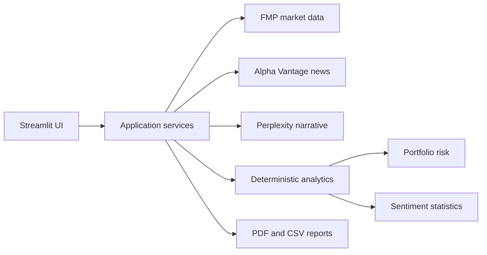

# Architecture

## Design decisions

- Python computes all numeric metrics; the language model explains supplied
  results and is not trusted to recompute them.
- News tone and price risk remain separate dimensions.
- FMP is the single price source; Alpha Vantage is used only for news data.
- Provider clients own transport, timeout and sanitized error handling.
- Demo news is synthetic and clearly labeled.

## Main modules

| Module | Responsibility |
|---|---|
| `services.py` | FMP and Perplexity clients |
| `sentiment.py` | Alpha Vantage parsing and descriptive statistics |
| `quant.py` | Volatility, historical VaR/CVaR, HHI and risk contribution |
| `analysis.py` | Explainable heuristics and bounded AI prompts |
| `ui.py` | Streamlit navigation and presentation |
| `reports.py` | PDF output |

## Known limitations

- Historical VaR is backward-looking and sensitive to the selected window.
- The educational 0–100 heuristic is not an industry rating.
- Sentiment scores inherit provider methodology and source-selection bias.
- Visual alignment of sentiment and price does not establish causality.
