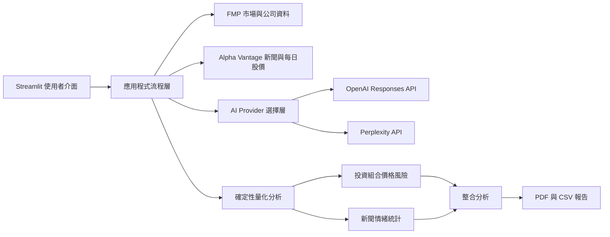
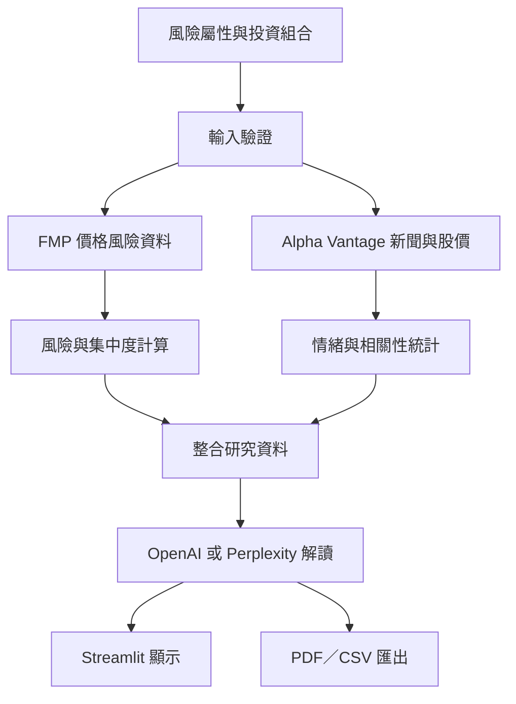
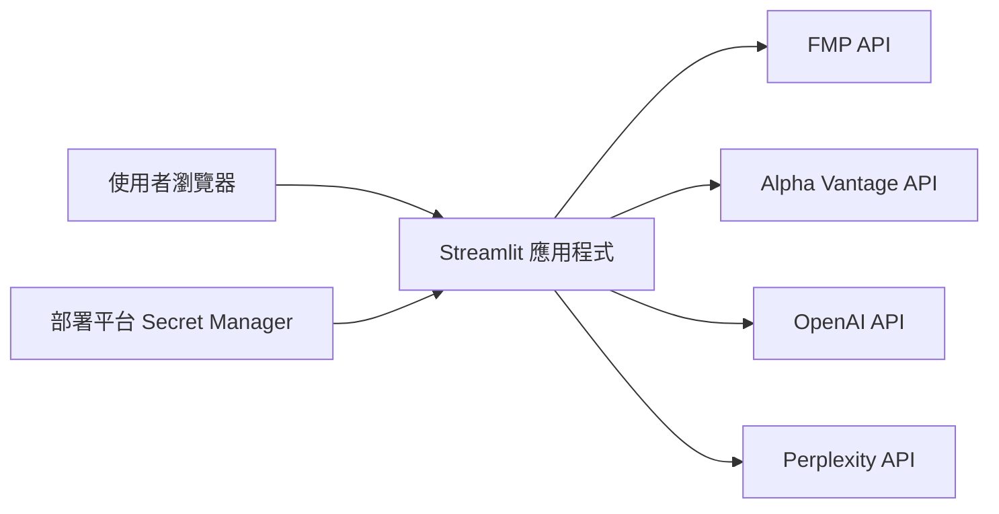

# SignalLens 系統架構說明

本文件是 [`ARCHITECTURE.md`](ARCHITECTURE.md) 的繁體中文版，說明 SignalLens Portfolio Intelligence 的技術架構、資料流程、模組分工、安全設計與已知限制。

## 整體架構



## 核心資料流程

整合分析按照以下順序運作：

1. 使用者設定風險屬性、可投資資金及投資組合配置。
2. 系統驗證股票代碼、重複持倉與配置總和。
3. 從 FMP 取得各持倉的歷史價格、公司資料、產業及選配 Beta。
4. Python 計算資產與投資組合風險指標。
5. 從 Alpha Vantage 取得各非現金持倉的新聞情緒及每日股價。
6. Python 計算情緒分布、來源、主題、趨勢及新聞覆蓋率。
7. 系統將價格風險與新聞情緒以兩個獨立維度交給 AI 解讀。
8. 使用者可在畫面檢視結果，並下載整合 PDF 與 CSV。



## 重要設計決策

### 數值由 Python 計算

波動率、最大回撤、VaR、CVaR、HHI、風險貢獻及情緒統計均由 Python 計算。語言模型只解讀系統提供的結構化結果，不負責重新計算關鍵數值。

這項設計可提高：

- 計算結果的一致性與可重現性。
- 測試覆蓋與錯誤追蹤能力。
- AI 回答的可控性。
- 面試展示時的技術可信度。

### 風險與情緒不合併成單一分數

投資組合風險採用 0–100 分；新聞情緒採用 -1～+1。兩者沒有經過實證驗證的共同量尺，因此系統不將它們直接相加，也不產生買進或賣出訊號。

整合頁只建立二維狀態，例如：

```text
高價格風險／正向新聞情緒
中等價格風險／中性或分歧新聞情緒
低價格風險／負向新聞情緒
```

### 多資料來源分工

- FMP：投資組合歷史價格、公司基本資料、產業與 Beta。
- Alpha Vantage：新聞情緒及新聞頁每日 OHLCV 股價。
- OpenAI：優先處理新聞與整合研究報告。
- Perplexity：可處理投資組合報告，也可作為未設定 OpenAI 時的替代 AI Provider。

系統不會在未標示的情況下，把不同供應商的資料混為同一來源。

### 離線展示模式

離線模式使用明確標示的合成資料，不會呼叫 FMP、Alpha Vantage、OpenAI 或 Perplexity。其目的為：

- 讓面試官不需要 API Key 即可操作系統。
- 避免展示時受到 API 配額或網路狀態影響。
- 提供穩定、可重現的 UI 冒煙測試環境。

離線資料不得被解讀為真實市場資訊。

## 主要模組

| 模組 | 主要責任 |
|---|---|
| `app.py` | Streamlit 程式進入點與全域錯誤邊界 |
| `ui.py` | 導覽、投資組合編輯器、整合分析流程與結果呈現 |
| `config.py` | 從環境變數或 Streamlit secrets 載入伺服器設定 |
| `services.py` | FMP、Perplexity 與 OpenAI API 用戶端 |
| `sentiment_provider.py` | Alpha Vantage 新聞情緒與每日股價用戶端 |
| `sentiment.py` | 新聞解析、情緒分類、來源／主題／時間統計與價格關聯 |
| `analysis.py` | 風險評分、組合情緒彙總與安全受限的 AI Prompt |
| `quant.py` | 共變異數波動率、歷史 VaR/CVaR、HHI 與風險貢獻 |
| `reports.py` | 內嵌繁體中文字型的整合 PDF 報告 |
| `validation.py` | 股票代碼與投資組合配置驗證 |
| `etf.py` | ETF 持倉解析、識別碼配對與重疊度分析 |
| `ptp.py` | 使用者提供之 PTP PDF 解析與持倉篩選 |
| `demo.py` | 離線合成資產與新聞資料 |

## AI Provider 選擇

AI 服務按照以下順序選擇：

1. 若設定 `OPENAI_API_KEY`，使用 OpenAI `gpt-5-mini`。
2. 否則若設定 `PERPLEXITY_API_KEY`，使用 Perplexity。
3. 若兩者皆未設定，量化功能仍可運作；離線整合流程使用固定的教育性摘要。

新聞標題與摘要屬於不可信的第三方內容。Prompt 會使用明確標記包住新聞資料，並要求模型忽略其中任何要求改變任務、洩漏資訊或執行指令的文字。

## API Key 與安全架構

API Key 只能放在：

- 本機 `.streamlit/secrets.toml`。
- 部署平台的 Secret Manager。
- 作業系統環境變數。

安全措施包括：

- `secrets.toml` 已由 `.gitignore` 排除。
- 不在 Streamlit 畫面要求輸入正式部署 Key。
- FMP Key 使用 HTTP Header 傳送，避免出現在一般 URL 日誌。
- Alpha Vantage 因供應商要求使用 query parameter，因此停用自動 HTTP 重試，降低帶 Key URL 被重複記錄的風險。
- 使用者錯誤訊息不包含 Key、完整 API 回應或內部堆疊。
- 外部服務皆設定連線及回應逾時。

## 狀態與快取

`st.session_state` 保存目前工作階段的：

- 投資組合配置。
- 現金比例。
- 最近一次風險分析。
- 最近一次單一股票情緒分析。
- 最近一次整合分析。

`st.cache_data` 用於短期快取市場資料，降低重複 API 請求與配額消耗；`st.cache_resource` 用於重用服務用戶端。API Key 本身不會顯示於快取結果。

## 測試策略

測試範圍包括：

- 風險屬性與資產風險公式。
- 現金部位的市場風險排除。
- 投資組合共變異數、VaR、CVaR、HHI 與風險貢獻。
- Alpha Vantage 新聞解析與情緒分類邊界。
- 股票情緒和文章情緒統計。
- 多持倉配置加權情緒。
- 情緒與次交易日報酬的日期對齊。
- AI Prompt 的不可信新聞隔離。
- ETF 識別碼配對、PTP 處理及 PDF 可讀性。
- Streamlit 首頁與離線整合流程的 UI 冒煙測試。

## 部署架構



瀏覽器只與 Streamlit 應用程式通訊。外部 API 呼叫由伺服器端發出，因此 API Key 不需要傳送到使用者瀏覽器。

## 已知限制

- 歷史 VaR 與 CVaR 屬於回顧性指標，結果會受到資料期間影響。
- 0–100 教育性風險分數不是信用評等或業界標準評級。
- 新聞情緒繼承 Alpha Vantage 的資料來源選擇與模型方法偏誤。
- 情緒和價格的相關係數只代表樣本中的統計關係，不代表因果。
- 新聞覆蓋率低時，組合情緒不能代表整個投資組合。
- 免費 API 的配額、資料範圍與端點資格可能由供應商調整。
- ETF 與 PTP 結果依賴使用者提供文件的正確性及更新日期。
- AI 文字可能有遺漏或錯誤，不能取代合格專業人員的判斷。

## 相關文件

- [`ARCHITECTURE.md`](ARCHITECTURE.md)：英文版系統架構摘要。
- [`UNIFIED_SYSTEM_SPEC.md`](UNIFIED_SYSTEM_SPEC.md)：合併後的功能需求與驗收標準。
- [`README.md`](../README.md)：專案介紹、安裝方式與啟動方法。
- [`SECURITY.md`](../SECURITY.md)：安全問題回報與憑證處理原則。
- [`CONTRIBUTING.md`](../CONTRIBUTING.md)：程式碼貢獻與測試流程。
